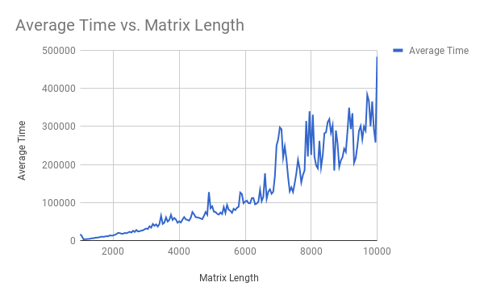

# MergeSort Vs. Runtime
  * ChickenBagel: Kathleen Wong, Jerry Ye, Thet Htay Zaw

### Hypothesis
  * For a n * n matrix, the worst case execution time of our search method is
    O(n).

### Background
  * We are testing an algorithm starts by traversing diagonally through the array, starting
     from the top left corner, until the next diagonal value is greater than the
     target value. At this point, we traverse through the rest of the row(to the right)
     to search for our target. If we find a value in the row greater than the target,
     we break because we know that the 2d array is in ascending order, and instead
     traverse down the rest of the column starting at the original diagonal location.
     In this algorithm, the worse case scenario should be when the target number is at
     the bottom left corner.

### Experiment Methodology
  * Starting with an array of 1000 by 1000, one trial will consist of running
    our algorithm a thousand times and then dividing our result by a thousand to
    find the average time of one search execution. We are performing three trials
    for every array size between 1,000 by 1,000 and 10,000 by 10,000 by intervals of
    50. These three trials will be averaged into one single time for each array size,
    which will be presented in a graph.

### Results : Average Runtime for All Trials

   

### Conclusions
  * Our results prove that our hypothesis was incorrect and that our worst case
    execution time actually runs in O(n^2). We realized that because our algorithm
    starts at at the top left and searches for a worst case at the bottom left,
    the worse case is actually O(n^2). Instead, we should have started at the top
    right, which would then make the worst case at the bottom left. There are
    large spikes in our graph that we cannot explain , but may be a result
    of our wrong algorithm.
