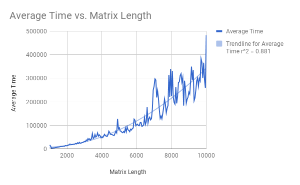

# Analyzing the Runtime of Our Matrix Search Algorithm 
  ChickenBagel: Kathleen Wong, Jerry Ye, Thet Htay Zaw  
  APCS2 PD02  
  Lab00 -- But What Does the Data Say?   
  2018-02-09
### Hypothesis
  * For a n * n matrix where every row and column is sorted in ascending order from smallest integer to largest integer, the worst case execution time of our search method is O(n).

### Background
  * The algorithm we are testing starts by traversing diagonally through the array, starting
     from the top left corner, until the next diagonal value is greater than the
     target value. At this point, we traverse through the rest of the row(to the right)
     to search for our target. If we find a value in the row greater than the target,
     we break because we know that the 2d array is in ascending order, and instead
     traverse down the rest of the column starting at the original diagonal location.
     In this algorithm, the worse case scenario should be when the target number is at
     the bottom left corner because in this case you are fully transversing across one row of
     the matrix and one column of the matrix. 
### Justification For Hypothesis
   * We believe our hypothesis is true because even in our worst case scenario you will only be transversing through one row and one column of a matrix. In an n by n matrix, this would be that we would be transversing through 2n elements, leading to a linear O(n) run time. 

### Experiment Methodology
  * Starting with a matrix of size n by n, one trial consisted of running
    our algorithm a thousand times and then dividing our result by a thousand to
    find the average time of one search execution for the matrix of size n by n. We performed three trials
    for every matrix size between 1,000 by 1,000 and 10,000 by 10,000 by intervals of
    50. Our trials were averaged into one single time for each matrix size that we tested on,
    which is presented in the graph below. We performed a large amount of tests on a large variety of matricies because we believed this would create the most accurate data. All of our tests were also performed on only one computer to control the effects of a computer's specs on the runtime of the experiment. 

### Results : Average Runtime for All Trials

   

### Conclusions
  * Our results aren't very conclusive becaue of the nature of how incosistent our data is. The correlations that the data show, however, support that our hypothesis was incorrect and that the worst case run time of our search algorithm actually runs in O(n^2) time. Despite all of the spikes and incosistencies in our data that we weren't able to fix, as the matrix length(n) increases, the change in the slope of the graph increases as well, representing an (n^2) run time instead of a linear run time. Unfortuntely, we weren't able to understand the flawed reasoning behind our serach algorithm; however, we must still note that our hypothesis still hasn't necessarily been proven entirely wrong. There are many factors that can affect run time which we thought were mostly mitigated by running 3 trials of 1000 tests, however, there could still be a few variables which were not kept constant. These variables are exemplified through the large amounts of spike seen in our data that we were unfortunately, not able to explain.
